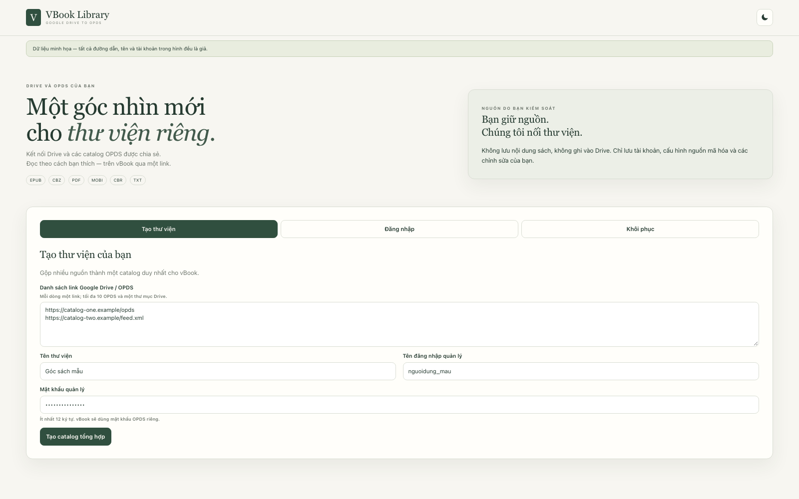
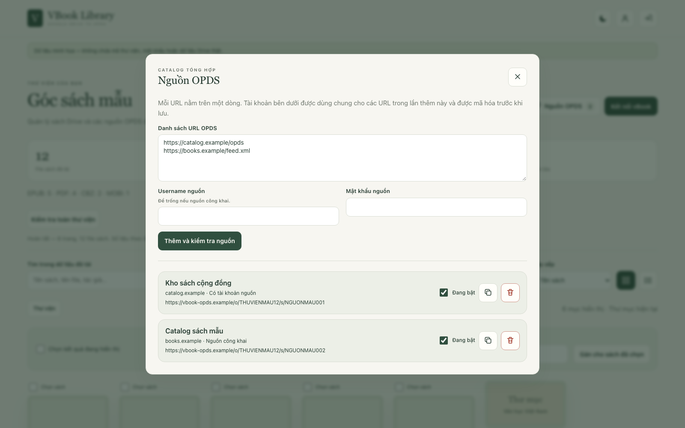
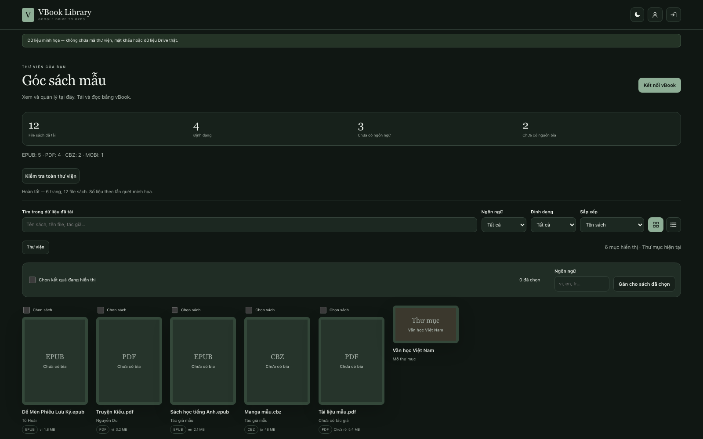
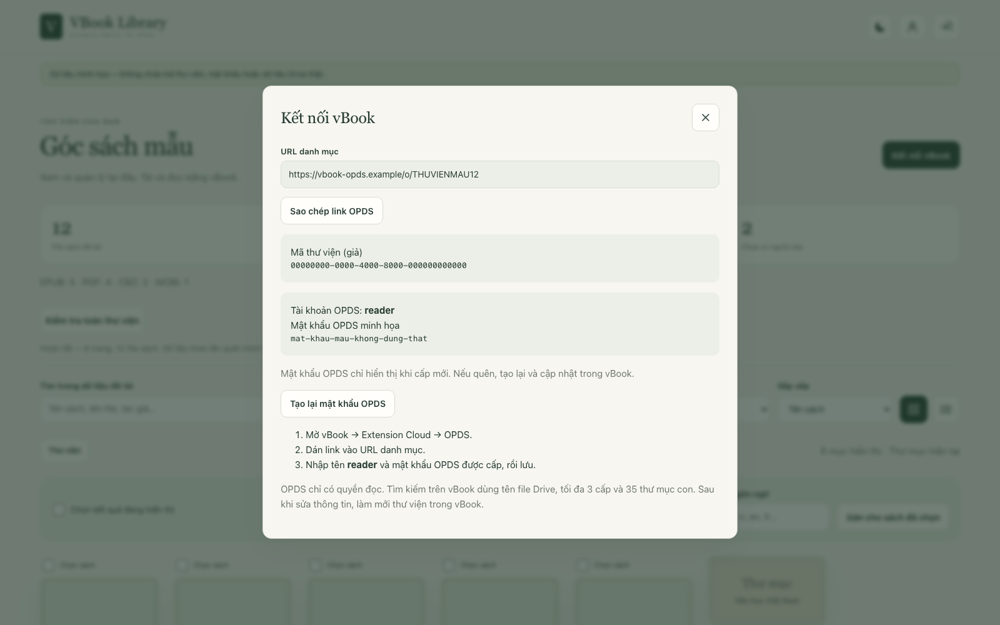

# VBook Library / OPDS Gateway — v1.8.0

Giao diện quản lý thư viện Google Drive và các catalog OPDS được chia sẻ dành cho vBook. Web có thể gộp hai loại nguồn vào một link OPDS ngắn, có tài khoản riêng.

**Không lưu nội dung sách, không ghi vào Drive.** D1 chỉ lưu tài khoản, cấu hình thư viện, phiên đăng nhập, metadata chỉnh sửa và danh sách sách OPDS bạn chọn ẩn. Nguồn Drive cần được chia sẻ “Bất kỳ ai có đường liên kết”; mật khẩu Gateway không thay đổi quyền truy cập file trên Google.

## Đã có

- Tạo thư viện bằng một thư mục Drive, danh sách OPDS có sẵn, hoặc cả hai.
- Thêm tối đa 10 URL OPDS mỗi lần; bật/tắt, sao chép link proxy ngắn hoặc xóa từng nguồn.
- Gộp sách Drive và các catalog OPDS vào một URL `/o/:short_id`; credential của nguồn được mã hóa trước khi lưu.
- Quét đồng thời Drive và các nguồn OPDS đang bật, đi theo catalog con/phân trang và gom sách vào cùng kết quả tìm/lọc trên web.
- Chọn, tải hoặc loại từng sách OPDS khỏi catalog tổng hợp; thao tác loại không xóa sách ở nguồn của người khác.
- Kệ bìa / bảng danh sách, duyệt thư mục và phân trang.
- Tìm/lọc trong dữ liệu đã tải theo tên, tác giả, ngôn ngữ, định dạng.
- Quét toàn thư viện theo từng trang, không giới hạn 35 thư mục hoặc 3 cấp; tạm dừng/thử lại, đếm file duy nhất và hiển thị tiến độ.
- Sửa tên hiển thị, tác giả, ngôn ngữ, thể loại, mô tả, URL bìa HTTPS; gán ngôn ngữ hàng loạt và khôi phục dữ liệu nguồn.
- OPDS nhận metadata đã sửa, giữ đuôi file và MIME type. Download HTTP 302 sang Drive với `confirm=t`.
- Tài khoản OPDS chỉ đọc, độc lập với tài khoản quản lý. Đổi mật khẩu, mã khôi phục một lần, tạo lại credential OPDS, xóa thư viện.
- EPUB, CBZ, PDF, MOBI, CBR, TXT và các định dạng vốn có: AZW/AZW3, PRC, FB2/FB2.ZIP, DOC/DOCX, ZIP.

## Chạy cục bộ

Yêu cầu Node.js **22.13+** (bộ test dùng `node:sqlite`), pnpm.

```sh
pnpm install --frozen-lockfile
cp .dev.vars.example .dev.vars
# Điền GOOGLE_API_KEY và MASK_SECRET thật vào .dev.vars.
pnpm run db:migrate:local
pnpm dev
```

Mở URL localhost do Wrangler hiển thị. Cookie có `Secure`; localhost được các trình duyệt hiện đại xử lý như ngữ cảnh tin cậy. Nếu dùng tên miền dev khác, cấu hình HTTPS.

`wrangler.toml` chứa ID D1 giả chỉ dùng local. Không deploy ID này lên Cloudflare.

## Kiểm tra

```sh
pnpm run build
pnpm test
pnpm run bundle
pnpm run test:runtime
pnpm audit
```

- `build`: typecheck TypeScript.
- `test`: bộ Gateway cũ, migration/query SQL SQLite thực, API/quyền truy cập và tương tác giao diện DOM.
- `bundle`: build Worker bằng Wrangler dry-run, không publish.
- `test:runtime`: chạy bundle trên Miniflare với D1 cục bộ và Drive metadata giả lập; cần cổng localhost.

Các test không dùng tài khoản/file thật và không thay cho kiểm tra cuối trên app vBook, Drive thật hoặc kiểm tra bố cục trình duyệt.

## Hướng dẫn sử dụng

Người dùng thông thường chỉ cần ứng dụng **vBook** và ít nhất một nguồn: thư mục Google Drive chứa sách hoặc các link OPDS được chia sẻ. Không cần tự tạo API key nếu người quản trị đã triển khai VBook Library.

> Tất cả tên, đường dẫn, mã thư viện và mật khẩu trong phần hướng dẫn và hình minh họa dưới đây đều là dữ liệu giả.

### 1. Chuẩn bị nguồn sách

Nếu đã có link OPDS do người khác chia sẻ, bạn có thể bỏ qua phần Google Drive và dùng link đó ở bước 3.

Nếu dùng Google Drive:

1. Tạo một thư mục và đưa các file EPUB, PDF, CBZ, CBR, MOBI hoặc TXT vào đó. Có thể dùng thư mục con để phân loại.
2. Chọn **Chia sẻ** → **Bất kỳ ai có đường liên kết** → quyền **Người xem**.
3. Sao chép liên kết thư mục.

Ví dụ giả:

```text
https://drive.google.com/drive/folders/THU_MUC_MAU_123
```

### 2. Tạo thư viện

Mở VBook Library, chọn **Tạo thư viện**, rồi dán mỗi nguồn trên một dòng. Hệ thống nhận tối đa 10 URL OPDS HTTPS và một link `drive.google.com`, sau đó gộp tất cả vào cùng một catalog. Nhập tên thư viện, tên đăng nhập và mật khẩu quản lý dài ít nhất 12 ký tự; bạn cũng có thể để trống danh sách và thêm nguồn ở bước 3.



Bấm **Tạo catalog tổng hợp** và lưu ngay:

- **Mã thư viện** để đăng nhập lại.
- **Mã khôi phục** để đặt lại mật khẩu quản lý.
- **Mật khẩu OPDS** để kết nối vBook.

Mã khôi phục và mật khẩu OPDS chỉ hiển thị khi vừa được cấp. Không nhập mật khẩu quản lý vào vBook.

### 3. Thêm các link OPDS đã có

Trong trang quản lý, bấm **Nguồn OPDS**. Dán mỗi URL trên một dòng; mỗi lần có thể thêm từ 1 đến 10 URL.



- Nguồn công khai: để trống username và mật khẩu.
- Nguồn có Basic Auth: nhập tài khoản mà chủ nguồn đã cấp. Một lần thêm dùng chung tài khoản cho các URL trong ô.
- Sau khi kiểm tra thành công, dùng công tắc để bật/tắt nguồn, biểu tượng sao chép để lấy link ngắn riêng, hoặc biểu tượng thùng rác để xóa.

Tài khoản nguồn không hiển thị lại trên giao diện. Nếu cần thay URL hoặc credential, hãy xóa nguồn cũ và thêm lại. Chỉ dùng URL `https://` công khai; địa chỉ localhost hoặc mạng nội bộ bị từ chối.

### 4. Quản lý sách Drive



Bạn có thể duyệt thư mục, đổi giữa kệ và bảng, tìm/lọc sách, sửa metadata, thêm URL bìa HTTPS và gán ngôn ngữ hàng loạt. Bấm **Kiểm tra toàn thư viện** để quét mọi thư mục con; không đóng hoặc tải lại trang khi đang quét.

Nút **Kiểm tra toàn thư viện** cũng quét các nguồn OPDS đang bật. Sách từ OPDS có nhãn **OPDS**, được đưa vào thống kê và bộ lọc chung; metadata này do nguồn bên ngoài cung cấp nên không chỉnh sửa trên trang quản lý.

Mỗi dòng sách có nút tải. Với sách OPDS, nút thùng rác chỉ loại sách khỏi catalog tổng hợp của bạn; file ở nguồn gốc không bị xóa. Có thể dùng checkbox để chọn nhiều sách OPDS rồi bấm **Xóa sách OPDS đã chọn**. Nếu chọn lẫn sách Drive và OPDS, nút gán ngôn ngữ chỉ áp dụng cho sách Drive.

Các thay đổi chỉ tác động đến thông tin hiển thị trong thư viện. Tên và nội dung file trên Drive không bị sửa.

Nếu thư viện chỉ có nguồn OPDS, khu vực sách Drive sẽ trống; đây không phải lỗi.

### 5. Kết nối vBook

Trong trang quản lý, bấm **Kết nối vBook**.



1. Sao chép link OPDS.
2. Trong vBook, mở **Extension Cloud → OPDS** và tạo nguồn mới.
3. Dán link vào **URL danh mục**.
4. Nhập username `reader` và mật khẩu OPDS của thư viện.
5. Lưu và mở kho sách.

Ví dụ giả, không dùng để đăng nhập:

```text
URL:      https://vbook-opds.example/o/THUVIENMAU12
Username: reader
Password: mat-khau-mau-khong-dung-that
```

Đây là catalog tổng hợp: trang đầu chứa các nguồn OPDS đã bật cùng sách/thư mục Drive. Feed Drive tự bổ sung phần mở rộng thật vào tên hiển thị. Sau khi thay đổi nguồn hoặc metadata, hãy làm mới catalog trong vBook vì ứng dụng có thể giữ cache riêng.

### Đăng nhập lại và khôi phục

Để đăng nhập lại, nhập mã thư viện, tên đăng nhập và mật khẩu quản lý tại tab **Đăng nhập**. Nếu quên mật khẩu, dùng tab **Khôi phục** cùng mã khôi phục đã lưu.

Sau khi khôi phục, mã khôi phục, phiên đăng nhập và mật khẩu OPDS cũ hết hiệu lực. Hãy lưu thông tin mới và cập nhật vBook. Hệ thống không khôi phục qua email.

### Sáng/tối

Bấm biểu tượng mặt trăng hoặc mặt trời trên thanh đầu trang. Lựa chọn được lưu trên thiết bị; nếu chưa chọn, giao diện theo cài đặt hệ thống.

### Lỗi thường gặp

| Hiện tượng | Cách xử lý |
|---|---|
| Không đọc được thư mục Drive | Kiểm tra quyền chia sẻ là **Bất kỳ ai có đường liên kết** và **Người xem** |
| vBook báo sai tài khoản | Username OPDS luôn là `reader`; không dùng tên đăng nhập quản lý |
| vBook báo sai mật khẩu | Dùng mật khẩu OPDS, không dùng mật khẩu quản lý |
| Không thấy thông tin vừa sửa | Làm mới hoặc mở lại kho OPDS trong vBook |
| Không thấy nguồn OPDS vừa thêm | Kiểm tra nguồn đang bật, rồi làm mới catalog trong vBook |
| Không thêm được nguồn OPDS | URL phải dùng HTTPS công khai và trả về OPDS XML/JSON hợp lệ; kiểm tra lại tài khoản nguồn |
| Link nguồn ngừng hoạt động | Nguồn bên ngoài có thể đổi URL/credential hoặc tạm ngừng; xóa rồi thêm lại nếu thông tin đã đổi |
| Quên mật khẩu OPDS | Mở **Kết nối vBook** và tạo lại mật khẩu OPDS |
| Quét bị dừng | Chờ khoảng một phút rồi bấm **Tiếp tục / thử lại** |
| Ảnh bìa không hiện | Dùng URL `https://`; máy chủ ảnh có thể chặn truy cập ngoài |
| Không tìm thấy toàn bộ sách | Chạy **Kiểm tra toàn thư viện**; tìm kiếm web chỉ áp dụng trên dữ liệu đã tải |
| Đã loại sách OPDS nhưng nguồn gốc vẫn còn | Đây là hành vi đúng: hệ thống chỉ ẩn sách khỏi catalog tổng hợp, không có quyền xóa ở nguồn của người khác |

Không chia sẻ mã khôi phục hoặc mật khẩu, không chụp màn hình chứa thông tin thật và không đặt API key/secret trong URL OPDS. Xóa thư viện trên web không xóa file trong Google Drive.

## Giới hạn và dữ liệu lưu

- Không có trình đọc online, upload bìa, OAuth Drive hoặc quyền ghi Drive.
- Proxy OPDS chỉ theo link cùng hostname với URL nguồn. Link sang hostname khác được giữ trực tiếp và không nhận credential đã lưu.
- Trình quét web chỉ đi theo catalog con và phân trang cùng hostname với nguồn. Metadata sách OPDS không được lưu vào D1 và không chỉnh sửa trên web; D1 chỉ lưu khóa của sách bạn đã chọn ẩn.
- Mỗi feed nguồn được giới hạn 2 MB và thời gian kết nối 20 giây. Việc đọc sách phụ thuộc vào tình trạng máy chủ OPDS bên ngoài.
- Không lưu database toàn bộ danh mục. Kết quả quét chỉ ở bộ nhớ trang; reload phải quét lại. Kho lớn tiêu tốn quota Drive và bộ nhớ trình duyệt.
- Tìm/lọc **web** áp dụng trên tập đã tải; chỉ đủ toàn kho sau khi quét xong.
- Tìm kiếm **OPDS** giữ thuật toán Gateway: tên file Drive, tối đa 3 cấp/35 thư mục con; chưa tìm theo tên chỉnh sửa.
- D1 lưu token thư mục, URL và credential nguồn OPDS dưới dạng mã hóa, khóa file HMAC, metadata và URL bìa; không gọi đây là hệ thống “không lưu dữ liệu”.
- Ảnh tải trực tiếp từ URL trên trình duyệt/vBook; backend không tải hoặc lưu ảnh. Host ảnh có thể chặn truy cập hoặc URL hết hạn.
- Xóa thư viện xóa dữ liệu hoạt động trong D1; dữ liệu vẫn có thể nằm trong thời hạn backup của nhà cung cấp.
- Giữ `MASK_SECRET` ổn định và sao lưu. Đổi secret làm hỏng token nguồn và ánh xạ metadata hiện có; chưa có migration đổi khóa.

## Triển khai

Yêu cầu Node.js 22.13+, pnpm, tài khoản Cloudflare Workers/D1 và `MASK_SECRET` ngẫu nhiên ổn định dài ít nhất 32 ký tự. `GOOGLE_API_KEY` cần khi dùng nguồn Drive.

```sh
pnpm install --frozen-lockfile
pnpm exec wrangler login
pnpm exec wrangler d1 create vbook-library
cp wrangler.production.toml.example wrangler.production.toml
```

Thay `replace-with-your-d1-database-id` trong file local `wrangler.production.toml`, sau đó chạy:

```sh
pnpm exec wrangler d1 migrations apply DB --remote --config wrangler.production.toml
pnpm exec wrangler secret put GOOGLE_API_KEY --config wrangler.production.toml
pnpm exec wrangler secret put MASK_SECRET --config wrangler.production.toml
pnpm run precommit
pnpm run bundle
pnpm run test:runtime
pnpm run deploy
```

`wrangler.production.toml` bị Git bỏ qua. Không lưu API key, `MASK_SECRET`, mật khẩu hoặc ID hạ tầng trong repository, URL hay ảnh chụp. Sao lưu D1 trước migration mới và giữ `MASK_SECRET` ổn định; thay hoặc mất secret sẽ làm hỏng token nguồn và ánh xạ metadata hiện có.

Sau deploy, dùng một thư mục Drive thử để kiểm tra tạo thư viện, quét thư mục con, sửa metadata, Basic Auth OPDS, phân trang, bìa và tải sách trên vBook thật. Theo dõi lỗi 401/429/5xx và mức sử dụng D1/Drive trên Cloudflare; không ghi credential hoặc URL Drive vào log.

## Tương thích bản cũ

**Từ v1.5.1:** route legacy mặc định tắt. Chỉ bật `ENABLE_LEGACY_ROUTES=true` khi cần; tài khoản cấu hình trên server áp dụng cho toàn bộ route legacy. Link `?auth=` trả về 410. Xem [báo cáo bảo mật](docs/security-audit.md).

- Khi bật legacy: `/legacy` là giao diện tạo link nhanh cũ; có thêm `/api/mask`, `/feed/:folderId`, `/download/:fileId`.
- Link cũ không tự nhận chỉnh sửa D1. Tạo thư viện mới từ Drive để nhận URL ngắn `/o/:shortId`; route `/library/:id/opds` vẫn được giữ để tương thích.
- Link `?auth=` cũ phải được thay bằng URL OPDS thư viện mới; cơ chế cũ không bảo vệ khi người giữ link xóa/thay tham số.

## Mã nguồn

| Thành phần | File |
|---|---|
| Router Gateway và giao diện gốc | `src/index.ts` |
| API quản lý, OPDS có tài khoản | `src/library.ts` |
| Kiểm tra, mã hóa cấu hình và proxy nguồn OPDS | `src/opds-source.ts` |
| Đọc catalog/phân trang và chuẩn hóa sách OPDS để quét | `src/opds-scan.ts` |
| Tham chiếu mã hóa, password hash, HMAC | `src/library-security.ts` |
| D1, kiểm tra và ghép metadata | `src/library-data.ts` |
| Feed thư viện mới | `src/library-feed.ts` |
| HTML/CSS và tương tác UI | `src/library-ui.ts`, `src/library-client.ts` |
| Đọc metadata Google Drive | `src/drive.ts` |
| Schema D1 | `migrations/` (apply every file in order) |

## Giấy phép

Mã nguồn được phát hành theo [MIT License](LICENSE). Bạn có thể sử dụng, sao chép, sửa đổi và phân phối theo các điều khoản trong file giấy phép.

Giấy phép này chỉ áp dụng cho mã nguồn của project, không cấp quyền đối với sách, ảnh bìa hoặc dữ liệu được người dùng kết nối từ Google Drive.
